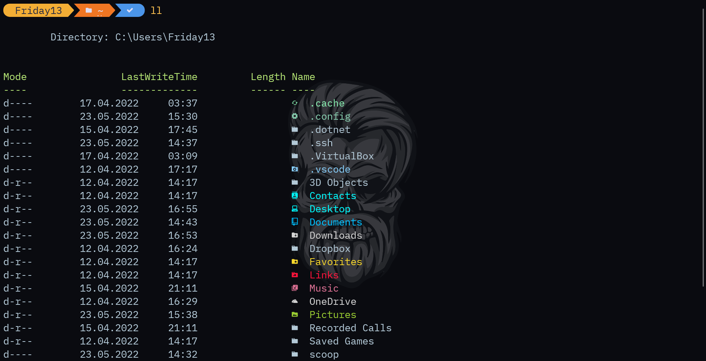
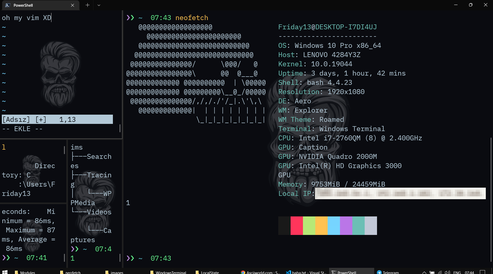

# WindowsTerminal

Paste the files in the specified location

```diff
- Please check the contents before copying the files
+ My windows user name  may be written in the file, if you find it, don't forget to edit it according to you.
@@ I will add $env:UserName to automate it in next update.@@
```

# .config

```shell
C:\Users\<username>\.config
```

# PowerShell

```shell
C:\Users\<username>\Documents
```

# settings.json

this is the default location of your terminal, the file path may change along with the version number.

```shell
C:\Users\<username>\AppData\Local\Packages\Microsoft.WindowsTerminal_8wekyb3d8bbwe\LocalState
```



## Split


